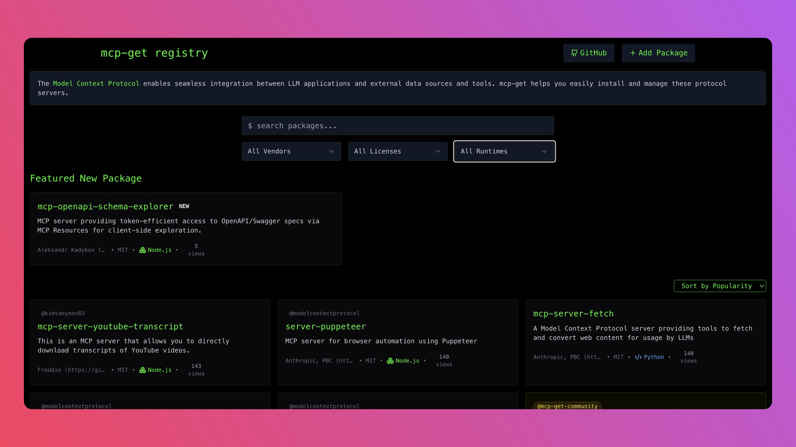

**I would have understood MCP better if someone had explained me like this**

Let's do a roleplay-

**Are you a solo founder building a SaaS and stuck in decision paralysis?**

Then you know, there are 100s of decisions you have to make daily to make sure that your SaaS reaches the right people.

You need to iterate a lot on your product so that it solves the issue your customer is facing.

You need to market it well to reach your Ideal Customer in minimal time.

You need to come up with many creative ideas and strategies to win this game.

**So what exactly is it that will save you time?**

**Long answer- It depends**

**Optimal answer- MCP**

And why exactly am I betting on MCP or the Model Context Protocol developed by Anthropic?

See, as a one-person building your own company, you need to make micro decisions, and you need help.

So, before understanding how MCP works, you need to understand how it can help you.

See, LLM is your secretary that you just hired.   

But that person is new and doesn’t know a lot of things about your work, and we could say they don’t have enough context.

Now, one way is you don’t trust that person, or that person is incapable of fetching data from the tools you are working ON.

**So now what? Either you copy/paste the data to your secretary via email or a chat messaging app.**

**Or you give them permission.**
**So, in the context of LLM, there comes MCP.**

**Basically, you give permission to LLM to fetch data on your behalf.**

In person, it’s easy, just give the userid/password or send it to a particular place for fetching.

 

But in coding standards, there’s no standard for that, and the existing solutions prevent bot activities for users’ data security, which prevents you from scraping.

So you give permission to the LLM to fetch data on your behalf.

It gains back-door activity via some defined protocols. [MCP Client and MCP Server]

 

You let LLM or MCP Client know that these are the 5 MCP servers, and each server has 5 tools, and these are the descriptions and what input/output they take is defined in the tools themselves.

So now the MCP Client knows about 25 tools.

 

**So if you tell your MCP to fetch some data from the Database.**

**Old way: write custom SQL queries**

**MCP way: Hey Claude, can you fetch the top 10 loyal users from the database?**

**The same goes for other operations like adding, editing or deleting some data from the database.**

 

This was just one MCP server, now we have different MCP servers which you can use.

So with MCP, your Claude desktop, Cursor, Windsurf, n8n, and Zapier become your personal AI secretary on steroids.

If you use VSCode, you can use the Cline extension to set up your MCP and use Openrouter or Claude API for these tasks

Or use n8n directly if you prefer no code and need a web UI.

Find MCP servers here- https://github.com/punkpeye/awesome-mcp-servers

My personal favourite is Claude for Agentic Purposes. What’s your favourite?

Check out this registry, which I find cool-

 
