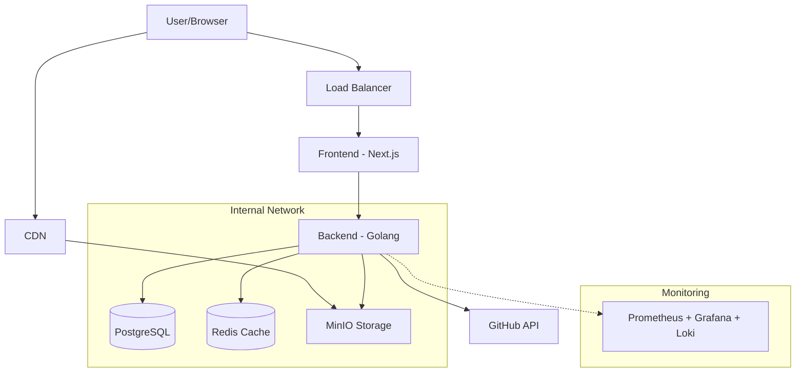
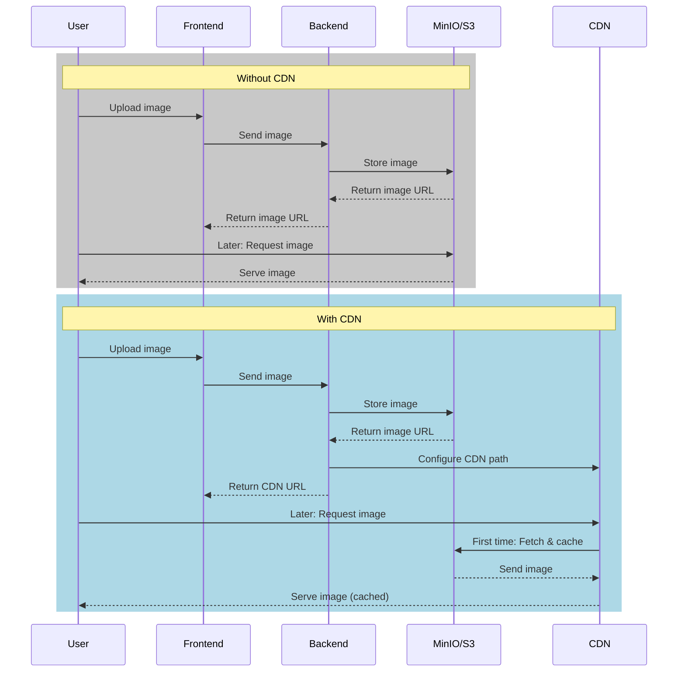

Let's sum up our final stack:

Project Components:

1. Features:
   - Profile management (CRUD)
   - Image upload/storage
   - GitHub contributions display
   - CDN for assets and images
   - Monitoring and logging

2. Tech Stack:
   - Frontend: Next.js
   - Backend: Golang
   - Database: PostgreSQL
   - Cache: Redis
   - Storage: MinIO
   - CDN: CloudFront/Similar
   - Monitoring: Prometheus, Grafana, Loki

Deployment Pipeline:

1. Development:
```yaml
# docker-compose.yml
services:
  frontend:
    build: ./frontend
  backend:
    build: ./backend
  postgres:
    image: postgres
  redis:
    image: redis
  minio:
    image: minio/minio
  prometheus:
    image: prom/prometheus
  grafana:
    image: grafana/grafana
  loki:
    image: grafana/loki
```

2. Staging/Production (Kubernetes):
```yaml
# Key Components
- Deployments:
  - Frontend
  - Backend
- StatefulSets:
  - PostgreSQL
  - Redis
- Services:
  - LoadBalancer
  - ClusterIP
- ConfigMaps/Secrets
- PersistentVolumes
```

3. CI/CD Flow:
```
Code Push -> Tests -> Build Images -> Push to Registry -> Deploy
```

Learning Outcomes:
1. Container Management:
   - Docker basics
   - Multi-container apps
   - Container orchestration

2. State Management:
   - Database persistence
   - Cache handling
   - File storage

3. Networking:
   - Service discovery
   - Load balancing
   - CDN integration

4. Monitoring:
   - Metrics collection
   - Log aggregation
   - Alerting

5. DevOps Practices:
   - CI/CD pipelines
   - Infrastructure as Code
   - Environment management


1. Basic app setup
2. Container configuration
3. Kubernetes manifests
4. Monitoring setup
5. CDN integration


All this will demonstrate:
- Container orchestration
- Service communication
- State management
- Load balancing
- Monitoring
- Log aggregation
- Storage handling
- Deployment strategies


