Report Compose Camp

* * *

Event - “Compose Camp”

10th September 2022 to 2th October 2022

Required Field| Information to be filled  
---|---  
Link for publicity on Social media * (Facebook//twitter/ Instagram) | [https://www.linkedin.com/posts/gdsc-aitpune_compose-camp-workflow-activity-6973640794121396224-bkQ7?utm_source=share&utm_medium=member_android](https://www.google.com/url?q=https://www.linkedin.com/posts/gdsc-aitpune_compose-camp-workflow-activity-6973640794121396224-bkQ7?utm_source%3Dshare%26utm_medium%3Dmember_android&sa=D&source=editors&ust=1737499577406312&usg=AOvVaw2Exfl5BOxLy9fwWHqC0Vp3)[https://www.linkedin.com/posts/gdsc-aitpune_compose-camp-workflow-activity-6973640794121396224-bkQ7?utm_source=share&utm_medium=member_android](https://www.google.com/url?q=https://www.linkedin.com/posts/gdsc-aitpune_compose-camp-workflow-activity-6973640794121396224-bkQ7?utm_source%3Dshare%26utm_medium%3Dmember_android&sa=D&source=editors&ust=1737499577407332&usg=AOvVaw02ZVw8oF8v4BlKueASWSDA)[https://www.instagram.com/p/CjIuKhUKh6P/?igshid=YmMyMTA2M2Y=](https://www.google.com/url?q=https://www.instagram.com/p/CjIuKhUKh6P/?igshid%3DYmMyMTA2M2Y%3D&sa=D&source=editors&ust=1737499577408262&usg=AOvVaw1q2TOXOxSkGrCTBVcLsznu)[https://www.instagram.com/p/CiSxm5nKian/?igshid=YmMyMTA2M2Y=](https://www.google.com/url?q=https://www.instagram.com/p/CiSxm5nKian/?igshid%3DYmMyMTA2M2Y%3D&sa=D&source=editors&ust=1737499577409062&usg=AOvVaw3Djc4tJZ1eafQfk-qrjupq)  
Academic Year *| 2022-2023  
Program driven by *(to be decided by social media coordinator)| Google Developers Students Club , AIT  
Program/Activity/Name *| “Compose Camp - Android Development”  
Select one of the Program Type *(Workshop/Leadership Talk/Motivation Speech/Field Visit/Other)| Other  
Select one of the Program Theme *(IPR/Innovation/Entrepreneurship/Startup/Other)| Other  
* Start Date | 10th September 2022  
* End Date|  2th October 2022  
Number of External Participants, If any| None  
*Mode of Session delivery (offline/online)| Offline  
*Number of Student Participants | 20  
*Number of Faculty Participants | None  
Expenditure Amount, If any| Rs 5,000   
* Benefit in terms of learning/Skill/Knowledge obtained| 1\. Understanding the Android architecture: Participants will gain a better understanding of the Android architecture, which includes the Android SDK, Android Studio, and Android APIs.2\. Working with databases: Participants will learn how to work with databases in Android, including how to create, query, and manage databases.3\. Writing efficient code: Participants will learn how to write efficient code for Android apps, including optimizing code for performance and memory usage and build better UI with Compose.  
*Objective | Compose Camp is an Android development educational session designed to help developers learn how to use the Jetpack Compose library to develop mobile applications. This session covers topics such as the Jetpack Compose architecture, writing UI code with Compose, and using Compose to create Material Design components. The session also covers how to use Compose for state management, debugging, styling, and animating. Additionally, the session includes hands-on exercises and demos to allow developers to practice their newly acquired skills.  
*Faculty Name (Faculty involved in organizing event)| Prof. Rupali Bagate (Faculty In-charge)  
*Student Name((student involved in organizing event)| Samik Choudhury (GDSC Lead)  
*Photograph1 | 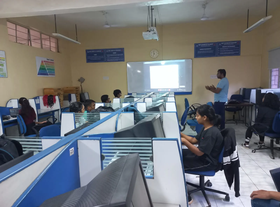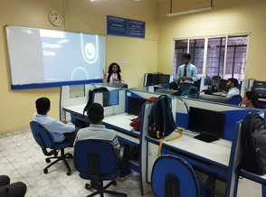  
*Photograph2 | 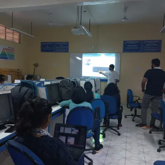  
*Session plan/Brochure/Document/overall report of the activity| [Session plan/Brochure/Document/overall report of the activity](https://www.google.com/url?q=https://docs.google.com/document/d/12BZTZlVNDQzmNbMhmdiyA20IGPb-DhDIxvun4dxU8so/edit?usp%3Dsharing&sa=D&source=editors&ust=1737499577427981&usg=AOvVaw1ZgM_F49Yt3AFmN_UNGpBZ)  
  
Compose Camp Sessions

Overview:

The Compose Camp Android development educational session was a great success. Over the course of the session, students were able to gain a comprehensive understanding of the fundamentals of Android development, including the basics of creating an Android application and the architecture of the Android platform. The students were also able to learn about the latest tools and technologies for Android development, including the Android SDK, Android Studio, and the Android Jetpack libraries. 

At the end of the session, the students presented their projects and the feedback was extremely positive. Many of the projects they created demonstrated a deep understanding of the principles of Android development as well as an impressive amount of creativity. Overall, the Compose Camp Android development educational session was a great success and the students walked away with a better understanding of the Android platform and the tools necessary to create great Android apps.

Also the quiz were conducted after the sessions, and questions were based on the topics discussed during the session. The winners were chosen based on their scores and would be given t-shirts and certificates as rewards.Winners will receive a prize package valued at Rs 5,000, including certificates, T-shirts, and stickers.

Day and Date| Time| Topic for the Day  
---|---|---  
Saturday, 10th September| 10:00 hrs to 13:00 hrs| Introductory Session  
Sunday, 11th September| 10:00 hrs to 13:00 hrs| Basics of Kotlin  
Thursday, 15th September| 17:00 hrs to 20:00 hrs| Compose UI  
Friday, 30th September| 17:00 hrs to 20:00 hrs| Work with API  
Saturday, 1st October| 10:00 hrs to 13:00 hrs| Modern App Architecture- 1  
Sunday, 2nd October| 10:00 hrs to 13:00 hrs| Modern App Architecture- 2  
Saturday, 8th October| 10:00 hrs to 13:00 hrs| How to read the codebase of an open source project?  
Sunday, 9th October| 10:00 hrs to 13:00 hrs| How to get internships in Android and make awesome projects?  
  
Detailed Report - Flutter Forward Event

Day 1: Introductory Session :

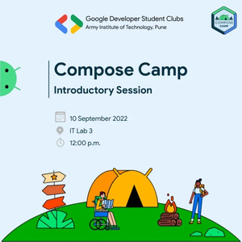

Date : 10th September 2022

Time : 12pm - 1pm

Mode : Offline (IT Lab III)

Topics covered :

Introduction to the Android Platform and Kotlin: This section introduces the Android platform and the Kotlin language, and provides an overview of the Android development process. 

Android Studio and the Android SDK: In this section, we will look at the Android Studio IDE, and the Android SDK, which contains all the necessary tools for Android development. 

Setting up your development environment: This section will show you how to set up your development environment, including downloading and installing the necessary software. 

Fundamentals of Kotlin and Android Development: In this section, we will learn the fundamentals of the Kotlin language and the Android SDK. We will look at topics such as activities, intents, and permissions. 

Android Studio Tools: This section covers the tools available within Android Studio, such as the layout editor, the debugger, and the emulator. 

Layouts and Views: In this section, we will look at how to create layouts and views in Android, as well as how to customise them.

Attendance and Attendee Details :

20 Students attended the session and below are the details of the participants -

Students Name| Registration or Roll No.  
---|---  
Kumari Riya| 4126  
Vishal Suthar| 22256  
Sachin kumar| 22223   
Ayush| 7114  
Ankush| 3114  
Ankit Singh| 22160  
Sumit Kumar Nath| 22403  
Satyajit | 22273  
Vignesh| 22362  
Ashish singh| 22292   
Aditya| 22183  
Gnana sagar| 7147  
Harshita| 7125  
Akhilesh Patidar| 7163  
Rishi Kumar Singh| 22285  
Yash Pathak| 22474  
Darshan| 22164  
Ayush| 22369  
J Vignesh Pandit| 1121  
  
Photographs of the session:

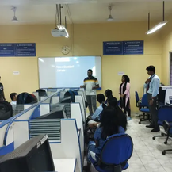 

Day 2: Build Basic App with Kotlin :

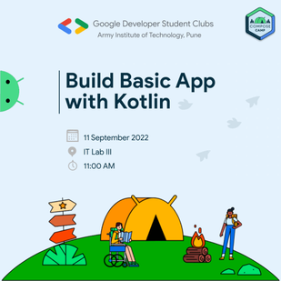

Date : 11th September 2022

Time : 11 am - 1 pm

Mode : Offline (IT Lab III)

Topics covered :

1\. Overview of Kotlin: Understanding the basics of Kotlin, the language and its features. 

2\. Setting up the Kotlin Development Environment: Exploring how to set up the development environment for creating Kotlin applications. 

3\. Data Types and Variables: Learning about the different data types and variables available in Kotlin. 

4\. Control Flow: Learning about the various control flow structures available in Kotlin. 

5\. Functions: Understanding the different ways of declaring and using functions in Kotlin. 

6\. Classes and Objects: Learning about classes, objects, and related concepts in Kotlin. 

7\. Lambda Expressions and Higher-Order Functions: Exploring how to use Lambda expressions and higher-order functions in Kotlin. 

8\. Collections and Generics: Learning about the different collections available in Kotlin and how to use generics in them. 

9\. Annotation Processing: Exploring how to use annotations in Kotlin for application development. 

10\. Coroutines: Learning about coroutines and how to use them in Kotlin.

Attendance and Attendee Details :

20 Students attended the session and below are the details of the participants -

Students Name| Registration or Roll No.  
---|---  
Kumari Riya| 4126  
Vishal Suthar| 22256  
Sachin kumar| 22223   
Ayush| 7114  
Ankush| 3114  
Ankit Singh| 22160  
Sumit Kumar Nath| 22403  
Satyajit | 22273  
Vignesh| 22362  
Ashish singh| 22292   
Aditya| 22183  
Gnana sagar| 7147  
Harshita| 7125  
Akhilesh Patidar| 7163  
Rishi Kumar Singh| 22285  
Yash Pathak| 22474  
Darshan| 22164  
Ayush| 22369  
J Vignesh Pandit| 1121  
  
Photographs of the session:

 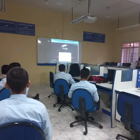

Day 3: Compose UI:

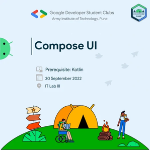

Date : 30 September 2022

Time : 11 am - 1pm

Mode : Offline (IT Lab III)

Topics covered : 

1\. Writing the Code: In this section, you will learn how to write code in the Compose language, including the basics of object-oriented programming concepts, data structure and algorithms. 

2\. Debugging: Debugging is an essential part of the development process, and in this section you will learn how to debug Compose applications. 

3\. Testing: Writing tests is an important part of development, and in this section you will learn how to write unit and integration tests for Compose applications. 

4\. Deployment: In this section, you will learn how to deploy a Compose application to a production environment. 

5\. Data Storage: In this section, you will learn how to use Compose to store data in a database or other persistent storage. 

6\. Security: Security is an important aspect of application development, and in this section you will learn how to secure Compose applications. 

7\. Platforms: In this section, you will learn how to deploy Compose applications on different platforms, such as mobile and web. 

8\. Troubleshooting: In this section, you will learn how to troubleshoot and debug Compose applications.

Attendance and Attendee Details :

20 Students attended the session and below are the details of the participants -

Students Name| Registration or Roll No.  
---|---  
Kumari Riya| 4126  
Vishal Suthar| 22256  
Sachin kumar| 22223   
Ayush| 7114  
Ankush| 3114  
Ankit Singh| 22160  
Sumit Kumar Nath| 22403  
Satyajit | 22273  
Vignesh| 22362  
Ashish singh| 22292   
Aditya| 22183  
Gnana sagar| 7147  
Harshita| 7125  
Akhilesh Patidar| 7163  
Rishi Kumar Singh| 22285  
Yash Pathak| 22474  
Darshan| 22164  
Ayush| 22369  
J Vignesh Pandit| 1121  
  
Photographs of the session:

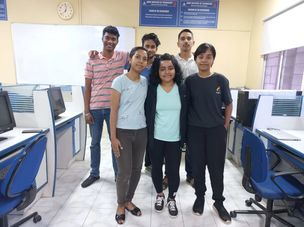

Day 4: Modern App Architecture : 

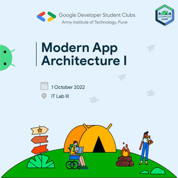

Date : 1st October 2022

Time : 11 am - 12pm

Mode : Offline (IT Lab III)

Topics covered : 

1\. Architecture Components and Patterns: Discussing and exploring the best practices and components of modern Android app architecture such as MVP, MVVM, and Clean Architecture, and how to implement them in your apps. 

2\. Persistence and Data Storage: Exploring the different options for storing data in Android apps, including the usage of SQLite, Room, and more. 

3\. Network Communication: Exploring the different methods for making network requests in Android apps, such as Retrofit, Volley, and OkHttp. 

4\. Reactive Programming: Exploring the different reactive programming frameworks available for Android, such as RxJava and Coroutines, and how to use them effectively. 

5\. Testing: Exploring the different options for testing Android apps, including unit tests and UI tests. 

6\. Dependency Injection: Exploring the different options for dependency injection frameworks available for Android, such as Dagger and Koin.

Attendance and Attendee Details :

20 Students attended the session and below are the details of the participants -

Students Name| Registration or Roll No.  
---|---  
Kumari Riya| 4126  
Vishal Suthar| 22256  
Sachin kumar| 22223   
Ayush| 7114  
Ankush| 3114  
Ankit Singh| 22160  
Sumit Kumar Nath| 22403  
Satyajit | 22273  
Vignesh| 22362  
Ashish singh| 22292   
Aditya| 22183  
Gnana sagar| 7147  
Harshita| 7125  
Akhilesh Patidar| 7163  
Rishi Kumar Singh| 22285  
Yash Pathak| 22474  
Darshan| 22164  
Ayush| 22369  
J Vignesh Pandit| 1121  
  
Photographs of the session:

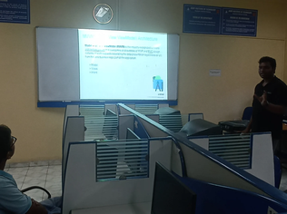 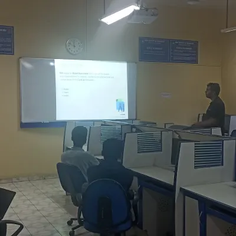

Day 5: Project Building :

Date : 2 October 2022

Time : 10 am - 12pm

Mode : Offline (IT Lab III)

Topics covered : 

Kotlin and Compose are two popular programming languages used for the development of Android applications. The Android Calculator application is an example of a simple application that can be built using Kotlin and Compose in this session to give the hands on expireance to the students..

The application consists of two primary components - a user interface and a back-end logic. The user interface is built with Compose, a declarative UI toolkit for creating modern Android applications. Compose allows developers to quickly and easily create complex UI layouts, animations, and transitions. The back-end logic is handled by Kotlin, a modern, statically typed programming language. Kotlin is designed to be easy to read and write, and it provides a wide range of features that make it well-suited for developing Android applications. 

The application follows the Model-View-ViewModel (MVVM) pattern, which is a popular architecture for Android applications. The ViewModel is responsible for managing the application's data and interacting with the back-end logic, while the View layer is responsible for displaying the data to the user. The ViewModel is written in Kotlin, and the View layer is written in Compose.

Attendance and Attendee Details :

20 Students attended the session and below are the details of the participants -

Students Name| Registration or Roll No.  
---|---  
Kumari Riya| 4126  
Vishal Suthar| 22256  
Sachin kumar| 22223   
Ayush| 7114  
Ankush| 3114  
Ankit Singh| 22160  
Sumit Kumar Nath| 22403  
Satyajit | 22273  
Vignesh| 22362  
Ashish singh| 22292   
Aditya| 22183  
Gnana sagar| 7147  
Harshita| 7125  
Akhilesh Patidar| 7163  
Rishi Kumar Singh| 22285  
Yash Pathak| 22474  
Darshan| 22164  
Ayush| 22369  
J Vignesh Pandit| 1121  
  
Photographs of the session:

 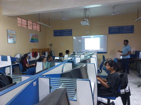

Conclusion:

At the conclusion of this android educational session, we have covered the basics of developing an android application, from designing the UI to adding features. We have also discussed the different tools and techniques used to develop an android application. We hope that students have gained a better understanding of android development and have the confidence to create their own application.After all the camp was the great success with the help of the faculty incharge , speakers and the students those who participated.
