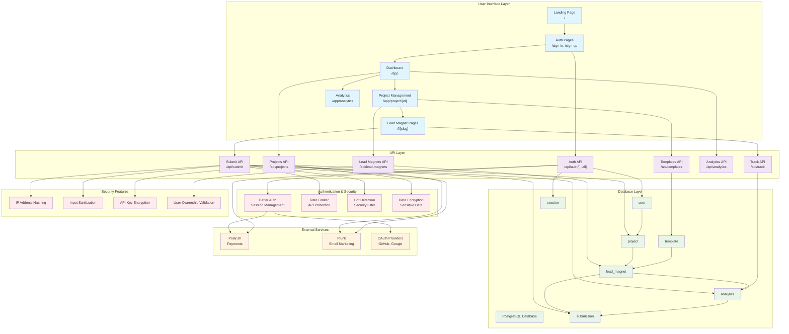
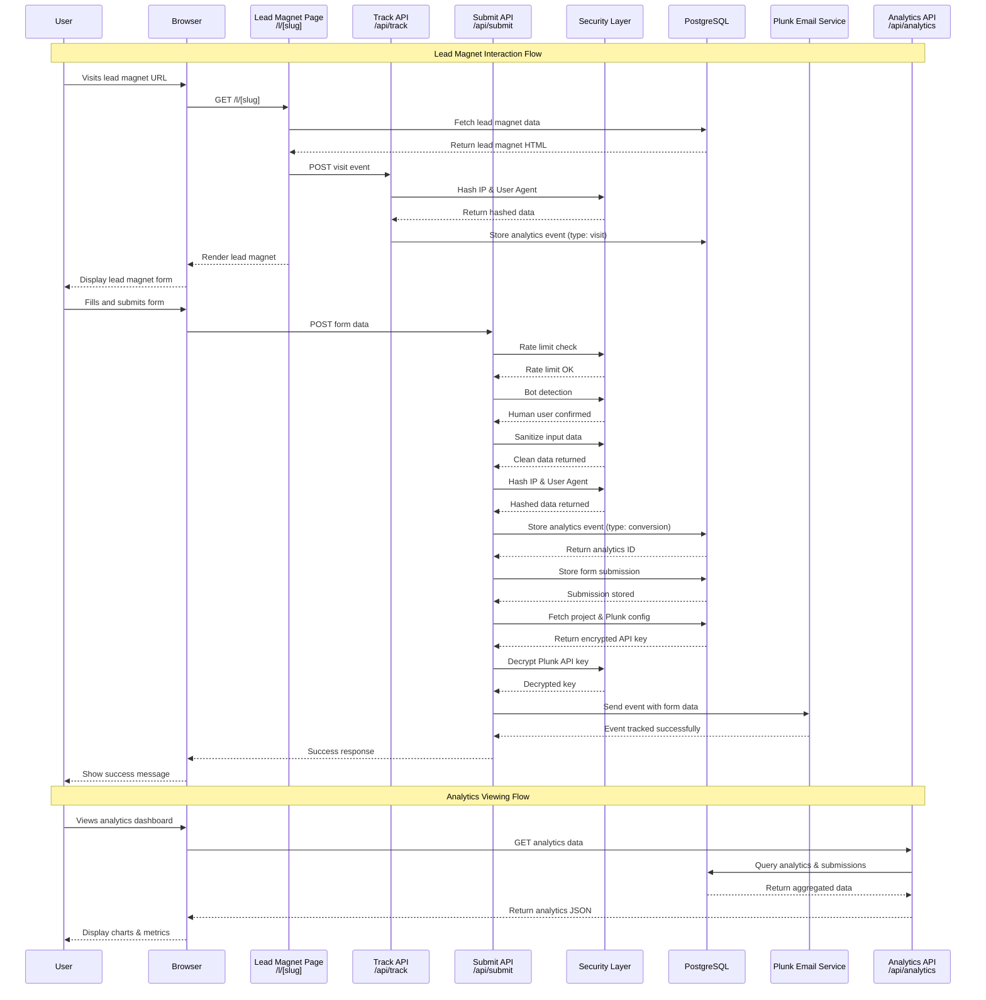
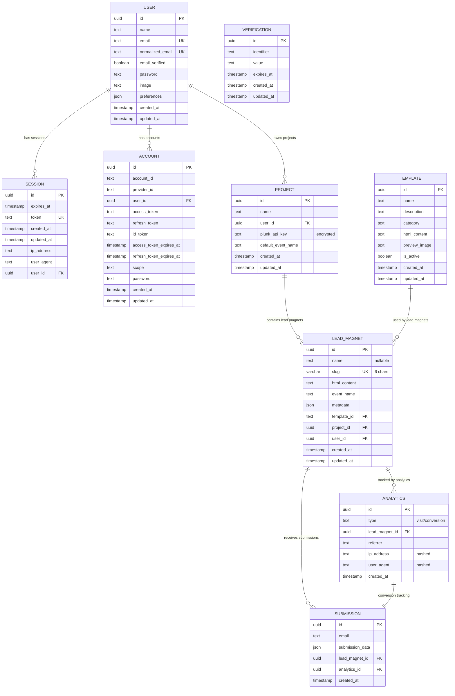

# GrabLink - Lead Magnet SaaS Kit - Architecture & Data Flows
# Updated: June 2025

## System Architecture Overview

GrabLink is a comprehensive Lead Magnet SaaS platform built with modern web technologies, featuring multi-project support, advanced analytics, template system, and robust security. The architecture follows a multi-layered approach with clear separation of concerns.

## High-Level System Architecture



## Data Flow Architecture

### Lead Magnet Interaction & Conversion Flow



## Database Schema & Relationships



## Frontend Component Architecture

```mermaid
graph TB
    subgraph "Root Layout"
        RootLayout["app/layout.tsx<br/>Theme Provider<br/>Auth Provider<br/>Internationalization"]
    end

    subgraph "Public Routes"
        LandingPage["app/page.tsx<br/>Landing Page"]
        PricingPage["app/pricing/page.tsx<br/>Pricing Page"]
        LeadMagnetPages["app/l/[slug]/page.tsx<br/>Lead Magnet Pages"]
        
        subgraph "Landing Components"
            HeroSection["hero-section.tsx"]
            FeaturesSection["features-section.tsx"]
            PricingSection["pricing-section.tsx"]
            FAQSection["faq-section.tsx"]
            FooterSection["footer-section.tsx"]
        end
    end

    subgraph "Auth Routes (auth)"
        AuthLayout["(auth)/layout.tsx<br/>Auth Layout"]
        SignIn["sign-in/page.tsx"]
        SignUp["sign-up/page.tsx"]
        ForgotPassword["forgot-password/page.tsx"]
    end

    subgraph "Premium Routes (premium)"
        PremiumLayout["(premium)/layout.tsx<br/>App Sidebar Layout"]
        
        subgraph "Dashboard"
            MainDashboard["app/page.tsx<br/>Enhanced Dashboard"]
            EnhancedDashboardComp["enhanced-dashboard.tsx<br/>Project Management"]
            CreateProjectDialog["create-project-dialog.tsx"]
            ProjectOnboarding["project-onboarding.tsx"]
            LeadMagnetOnboarding["lead-magnet-onboarding.tsx"]
        end
        
        subgraph "Project Management"
            ProjectPage["app/project/[projectId]/page.tsx"]
            LeadBuilder["lead-builder.tsx"]
            LeadMagnetDisplay["lead-magnet-display.tsx"]
        end
        
        subgraph "Analytics"
            ProjectAnalytics["app/analytics/project/[projectId]/page.tsx"]
            LeadMagnetAnalytics["app/analytics/[leadMagnetId]/page.tsx"]
            AnalyticsDashboard["analytics-dashboard-ui.tsx"]
        end
        
        subgraph "User Management"
            ProfileComponent["profile.tsx"]
            SettingsComponent["settings.tsx"]
            SubscriptionManagement["subscription-management.tsx"]
        end
    end

    subgraph "Shared UI Components"
        subgraph "Layout Components"
            AppSidebar["app-sidebar.tsx<br/>Navigation"]
            ThemeProvider["theme-provider.tsx"]
            ConditionalNav["conditional-navigation.tsx"]
        end
        
        subgraph "UI Primitives"
            Button["button.tsx"]
            Card["card.tsx"]
            Dialog["dialog.tsx"]
            Input["input.tsx"]
            Select["select.tsx"]
            Table["table.tsx"]
            Skeleton["skeleton.tsx"]
            Toast["sonner.tsx"]
        end
        
        subgraph "Advanced Components"
            FullScreenEditor["full-screen-editor.tsx"]
            FloatingNavbar["floating-navbar.tsx"]
            JSONView["json-view.tsx"]
            NotificationManager["notification-manager.tsx"]
        end
    end

    %% Layout hierarchy
    RootLayout --> LandingPage
    RootLayout --> PricingPage
    RootLayout --> LeadMagnetPages
    RootLayout --> AuthLayout
    RootLayout --> PremiumLayout

    %% Landing page composition
    LandingPage --> HeroSection
    LandingPage --> FeaturesSection
    LandingPage --> PricingSection
    LandingPage --> FAQSection
    LandingPage --> FooterSection

    %% Premium layout composition
    PremiumLayout --> AppSidebar
    PremiumLayout --> MainDashboard
    PremiumLayout --> ProjectPage
    PremiumLayout --> ProjectAnalytics
    PremiumLayout --> LeadMagnetAnalytics

    %% Dashboard composition
    MainDashboard --> EnhancedDashboardComp
    EnhancedDashboardComp --> CreateProjectDialog
    EnhancedDashboardComp --> ProjectOnboarding
    EnhancedDashboardComp --> LeadMagnetOnboarding

    %% Project management composition
    ProjectPage --> LeadBuilder
    ProjectPage --> LeadMagnetDisplay
    
    %% Analytics composition
    ProjectAnalytics --> AnalyticsDashboard
    LeadMagnetAnalytics --> AnalyticsDashboard

    %% Shared component usage
    AppSidebar --> ProfileComponent
    AppSidebar --> SettingsComponent
    SettingsComponent --> SubscriptionManagement

    %% UI component dependencies
    EnhancedDashboardComp --> Card
    EnhancedDashboardComp --> Button
    EnhancedDashboardComp --> Skeleton
    CreateProjectDialog --> Dialog
    CreateProjectDialog --> Input
    LeadBuilder --> FullScreenEditor
    AnalyticsDashboard --> Table
    AnalyticsDashboard --> Card
    
    %% Styling
    classDef publicRoute fill:#e3f2fd
    classDef authRoute fill:#f3e5f5
    classDef premiumRoute fill:#e8f5e8
    classDef sharedComponent fill:#fff8e1
    classDef layoutComponent fill:#fce4ec

    class LandingPage,PricingPage,LeadMagnetPages,HeroSection,FeaturesSection,PricingSection,FAQSection,FooterSection publicRoute
    class AuthLayout,SignIn,SignUp,ForgotPassword authRoute
    class PremiumLayout,MainDashboard,ProjectPage,ProjectAnalytics,LeadMagnetAnalytics,EnhancedDashboardComp,LeadBuilder,AnalyticsDashboard premiumRoute
    class Button,Card,Dialog,Input,Select,Table,Skeleton,Toast,FullScreenEditor,FloatingNavbar,JSONView,NotificationManager sharedComponent
    class RootLayout,AppSidebar,ThemeProvider,ConditionalNav layoutComponent
```



## API Architecture & Endpoints

### Authentication & User Management
| Endpoint | Method | Purpose | Authentication |
|----------|--------|---------|----------------|
| `/api/auth/[...all]` | ALL | Better Auth endpoints | Public |
| `/api/auth/actions` | POST | Auth actions (OTP, etc.) | Public |

### Project Management
| Endpoint | Method | Purpose | Authentication |
|----------|--------|---------|----------------|
| `/api/projects` | GET | List user projects | Required |
| `/api/projects` | POST | Create new project | Required |
| `/api/projects` | PUT | Update project | Required |
| `/api/projects/[id]` | DELETE | Delete project | Required |

### Lead Magnet Management
| Endpoint | Method | Purpose | Authentication |
|----------|--------|---------|----------------|
| `/api/lead-magnets` | GET | List lead magnets by project | Required |
| `/api/lead-magnets` | POST | Create lead magnet | Required |
| `/api/lead-magnets` | PUT | Update lead magnet | Required |
| `/api/lead-magnets/[id]` | DELETE | Delete lead magnet | Required |

### Analytics & Tracking
| Endpoint | Method | Purpose | Authentication |
|----------|--------|---------|----------------|
| `/api/analytics/project/[id]` | GET | Project analytics | Required |
| `/api/analytics/lead-magnet/[id]` | GET | Lead magnet analytics | Required |
| `/api/track` | POST | Track page visits | Public (rate limited) |

### Public APIs
| Endpoint | Method | Purpose | Authentication |
|----------|--------|---------|----------------|
| `/api/submit` | POST | Handle form submissions | Public (rate limited) |
| `/api/templates` | GET | List available templates | Public |

### Payment Integration
| Endpoint | Method | Purpose | Authentication |
|----------|--------|---------|----------------|
| `/api/polar-fallback/orders` | GET | Polar.sh order fallback | Required |
| `/api/polar-fallback/portal` | GET | Customer portal fallback | Required |

## Security Architecture

### Data Protection Layers

1. **Input Validation & Sanitization**
   - All user inputs validated on both client and server
   - HTML content sanitized before storage
   - URL sanitization for referrer tracking
   - JSON payload size limits (5KB for submissions)

2. **Rate Limiting**
   - Form submissions: 10 requests per minute per IP
   - API endpoints: Configurable rate limits
   - Bot detection with silent acceptance
   - Cooldown periods for repeated violations

3. **Data Privacy**
   - IP addresses hashed using crypto.createHash()
   - User agents hashed before storage
   - API keys encrypted using AES-256-GCM
   - Personal data minimization

4. **Access Control**
   - User ownership validation for all resources
   - Project-level access control
   - Session-based authentication with Better Auth
   - Route protection with middleware

### Advanced Security Features

#### Public ID Encoding/Decoding
```typescript
// Encode internal UUIDs for public-facing URLs
export function encodePublicId(id: string): string {
  const buffer = Buffer.from(id);
  return buffer.toString("base64url");
}

// Decode public IDs back to internal UUIDs
export function decodePublicId(publicId: string): string {
  const buffer = Buffer.from(publicId, "base64url");
  return buffer.toString();
}
```

#### Bot Detection System
```typescript
export function isBot(userAgent: string | null): boolean {
  if (!userAgent) return true;
  const botPatterns = [
    /bot/i, /crawler/i, /spider/i, 
    /headless/i, /selenium/i, /puppet/i
  ];
  return botPatterns.some((pattern) => pattern.test(userAgent));
}
```

#### User Agent Analysis
```typescript
// Preserve analytics capability while protecting privacy
export async function hashUserAgent(userAgent: string | null): Promise<string> {
  if (!userAgent) return "";
  const parser = new UAParser(userAgent);
  const { browser, os } = parser.getResult();
  return JSON.stringify({
    browser: browser.name,
    os: os.name,
    hash: crypto.createHash("sha256").update(userAgent).digest("hex"),
  });
}
```

#### HTML Sanitization
```typescript
export function sanitizeHtml(html: string): string {
  return html
    .replace(/<script\b[^<]*(?:(?!<\/script>)<[^<]*)*<\/script>/gi, "")
    .replace(/on\w+="[^"]*"/g, "")
    .replace(/javascript:/gi, "");
}
```

### Encryption & Hashing Standards

```typescript
// IP Address Hashing
const hashedIP = crypto.createHash('sha256')
  .update(ipAddress + SALT)
  .digest('hex');

// API Key Encryption (AES-256-GCM)
const cipher = crypto.createCipher('aes-256-gcm', encryptionKey);
const encrypted = cipher.update(data, 'utf8', 'hex') + cipher.final('hex');

// User Agent Hashing
const hashedUserAgent = crypto.createHash('sha256')
  .update(userAgent + SALT)
  .digest('hex');
```

## Middleware Configuration

### Route Protection & Session Management

```typescript
// src/middleware.ts
export async function middleware(request: NextRequest) {
  const { pathname } = request.nextUrl;
  
  // Health check endpoint for testing
  if (pathname.startsWith("/ping")) {
    return new Response("pong", { status: 200 });
  }
  
  // Public routes that don't require authentication
  const publicRoutes = [
    "/", "/pricing", "/forgot-password", 
    "/privacy-policy", "/terms-of-service"
  ];
  
  const publicAPIRoutes = [
    "/l/", "/api/submit", "/api/track"
  ];
  
  // Skip auth for public routes
  if (publicRoutes.includes(pathname) || 
      publicAPIRoutes.some(route => pathname.startsWith(route))) {
    return NextResponse.next();
  }
  
  // Check for valid session
  const sessionCookie = getSessionCookie(request);
  if (!sessionCookie) {
    return NextResponse.redirect(new URL("/sign-in", request.url));
  }
  
  return NextResponse.next();
}
```

### Middleware Configuration
```typescript
export const config = {
  matcher: [
    "/((?!_next/static|_next/image|favicon.ico|sitemap.xml|robots.txt|api/auth|sign-in|sign-up|l/|api/submit|api/track).*)",
  ],
};
```

## Type Definitions & Interfaces

### User & Preferences Types
```typescript
// src/types/user.ts
export type UserPreferences = {
  displayName?: string;
  profession?: string;
  responseStyleExample?: string;
};

export type User = {
  id: string;
  name: string;
  email: string;
  image: string | null;
  preferences?: UserPreferences;
};

export type UserRepository = {
  existsByEmail: (email: string) => Promise<boolean>;
  updateUser: (id: string, user: Pick<User, "name" | "image">) => Promise<User>;
  updatePreferences: (userId: string, preferences: UserPreferences) => Promise<User>;
  getPreferences: (userId: string) => Promise<UserPreferences | null>;
  findById: (userId: string) => Promise<User | null>;
};
```

### Validation Schemas
```typescript
export const UserZodSchema = z.object({
  name: z.string().min(1),
  email: z.string().email(),
  password: z.string().min(8),
});

export const UserPreferencesZodSchema = z.object({
  displayName: z.string().optional(),
  profession: z.string().optional(),
  responseStyleExample: z.string().optional(),
});
```

## Template System Assets

### Template Preview Assets
Located in `public/templates/`:
- `newsletter.svg` - Newsletter signup template preview
- `ebook.svg` - E-book download template preview  
- `webinar.svg` - Webinar registration template preview
- `checklist.svg` - Checklist download template preview
- `swipe.svg` - Swipe files template preview

### Template Categories & Usage
```typescript
const TEMPLATE_CATEGORIES = {
  newsletter: "Newsletter Signup",
  ebook: "E-Book Download", 
  webinar: "Webinar Registration",
  checklist: "Checklist Download",
  swipe: "Swipe Files Collection"
};
```

## Performance Architecture

### Caching Strategy
- **Memory Cache**: In-memory caching for frequently accessed data
- **Browser Storage**: Client-side state persistence
- **Database Indexing**: Optimized queries with proper indexes
- **Static Generation**: Lead magnet pages statically generated

### Optimization Features
- **Image Optimization**: Next.js Image component for responsive images
- **Code Splitting**: Automatic code splitting with Next.js
- **Lazy Loading**: Components loaded on demand
- **Tree Shaking**: Unused code elimination

## Deployment Architecture

### Environment Configuration
```bash
# Production Environment Variables
BETTER_AUTH_SECRET=<32+ character secret>
POSTGRES_URL=<database connection string>
POLAR_ACCESS_TOKEN=<polar.sh API token>
POLAR_LIFETIME_PRODUCT_ID=<product ID>
PLUNK_SECRET_KEY=<plunk API key>
BETTER_AUTH_URL=<production domain>

# Security Configuration
IP_HASH_SALT=<random salt for IP hashing>

# Optional OAuth Configuration
GITHUB_CLIENT_ID=<github oauth client id>
GITHUB_CLIENT_SECRET=<github oauth client secret>
GOOGLE_CLIENT_ID=<google oauth client id>
GOOGLE_CLIENT_SECRET=<google oauth client secret>

# Development Configuration
NO_HTTPS=true                    # Allow non-HTTPS cookies in development
DISABLE_SIGN_UP=false           # Disable new user registration
```

### Infrastructure Requirements
- **Node.js 18+**: Runtime environment
- **PostgreSQL 14+**: Database with UUID extension
- **SSL Certificate**: HTTPS required for production
- **CDN**: Recommended for static assets
- **Load Balancer**: For high-traffic deployments

## Additional Security Considerations

### Rate Limiting Configuration
```typescript
// Form submissions
const SUBMIT_RATE_LIMIT_WINDOW_MS = 60 * 1000; // 1 minute
const SUBMIT_RATE_LIMIT_MAX_REQUESTS = 10; // 10 submissions per minute per IP

// Data size limits
const MAX_SUBMISSION_DATA_SIZE = 5000; // 5KB limit for submission data
```

### Bot Protection
- Silent acceptance of bot submissions (returns success without processing)
- User agent pattern matching for common bots
- Headless browser detection
- Automated tool detection (Selenium, Puppeteer)

### Privacy Protection
- IP address salted hashing before storage
- User agent parsing with hash generation
- Referrer URL sanitization
- Generic error messages to prevent information leakage

This architecture documentation provides a comprehensive view of the GrabLink Lead Magnet SaaS platform, enabling developers to understand the system's design, data flows, and security considerations for effective development and maintenance.
